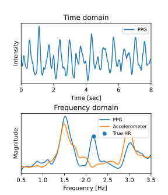

## BeliefPPG: Uncertainty-aware Heart Rate Estimation from PPG signals via Belief Propagation (UAI 2023, Official Code)

Valentin Bieri<sup>*2</sup>, [Paul Streli](https://paulstreli.com/)<sup>*1</sup>, Berken Utku Demirel<sup>1</sup>, [Christian Holz](https://www.christianholz.net/)<sup>1</sup>

<sup>1</sup> [Sensing, Interaction & Perception Lab](https://siplab.org/), Department of Computer Science, ETH Zürich, Switzerland
<br>
<sup>2</sup> MSc Student, Department of Computer Science, ETH Zürich, Switzerland
<br>
<sup>*</sup> These authors contributed equally to this work

___________

<p align="center">

</p>

---

> We present a novel learning-based method that achieves state-of-the-art performance on several heart rate estimation benchmarks extracted from photoplethysmography signals (PPG). We consider the evolution of the heart rate in the context of a discrete-time stochastic process that we represent as a hidden Markov model. We derive a distribution over possible heart rate values for a given PPG signal window through a trained neural network. Using belief propagation, we incorporate the statistical distribution of heart rate changes to refine these estimates in a temporal context. From this, we obtain a quantized probability distribution over the range of possible heart rate values that captures a meaningful and well-calibrated estimate of the inherent predictive uncertainty. We show the robustness of our method on eight public datasets with three different cross-validation experiments.

Contents
----------

<b>TL; DR</b>
<br>
This repository contains code to run leave-one-session-out cross-validation experiments on multiple supported datasets. Taking multi-channel PPG and Accelerometer signals as input, BeliefPPG predicts the instantaneous heart rate and provides an uncertainty estimate for the prediction.


- [Datasets](#datasets) 
- [Training and Inference](#training-and-inference) 
- [Citation](#citation)
- [License and Acknowledgement](#license-and-acknowledgement)

Datasets
----------
We provide a shell script which downloads the datasets DaLiA, WESAD, BAMI-1 and BAMI-2 from their original hosts. Run the following line in your terminal:

```
sh download_data.sh
```
- Note that WESAD does not natively include  ground truth HR. Labels can be generated from the provided ECG recordings instead.
- Support for the IEEE datasets is implemented, but the original data format seems to be no longer available. You can download it in the new format under https://zenodo.org/record/3902710#.ZGM9l3ZBy3C and restructure/convert the files or implement your own file reader.

Training and Inference
----------
Run the following in your terminal: 

```
python train_eval.py --data_dir ${DATA_PATH} --dataset dalia 
```

This will run LoSo cross-validation on the DaLiA dataset. On a modern GPU, expect one full run to take roughly 10-14 hours.
Results, that is the MAEs, predictions and models, are saved in the output directory, which can be specified with the `--out_dir` argument. *Note that you may have to reinstall h5py in order for the models to be saved correctly.*

We highly recommend that you use Weights&Biases to monitor model training. Make sure to log into W&B in the console and then simply add the argument `--use_wandb` to save additional plots and logging information.


Citation
----------
If your find our paper or codes useful, please cite our work:

    @InProceedings{bieri_741,
        title = {BeliefPPG: Uncertainty-aware heart rate estimation from PPG signals via belief propagation},
        author = {Bieri, Valentin and Streli, Paul and Demirel, Berken Utku and Holz, Christian},
        booktitle={},
        year={2023},
        organization={}
    }

License and Acknowledgement
----------
This project is released under the MIT license.


